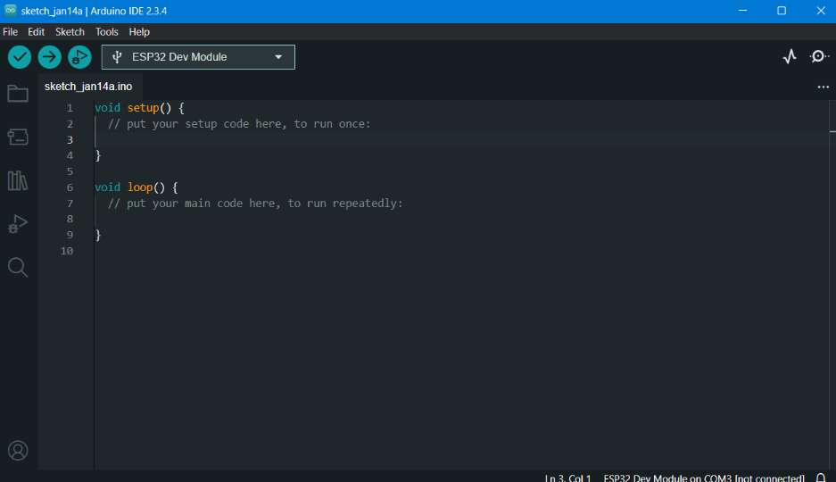
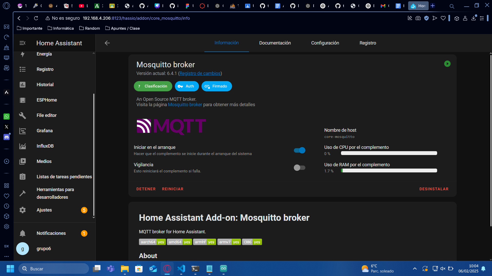
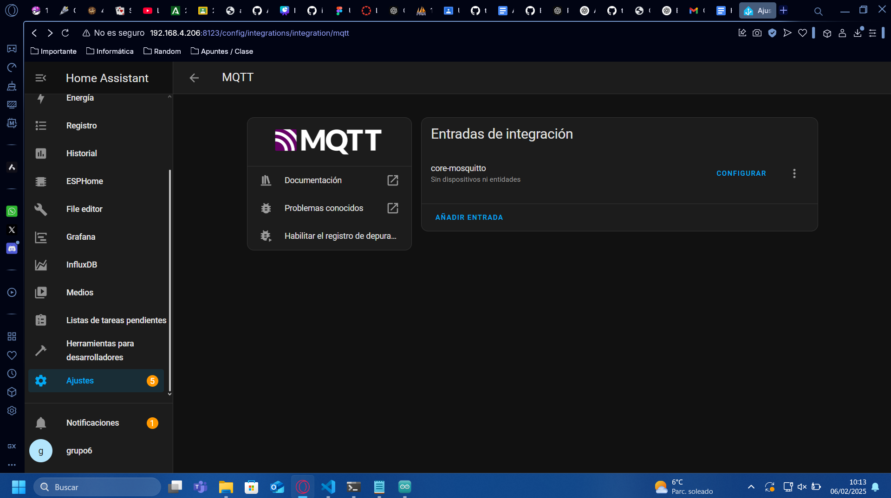
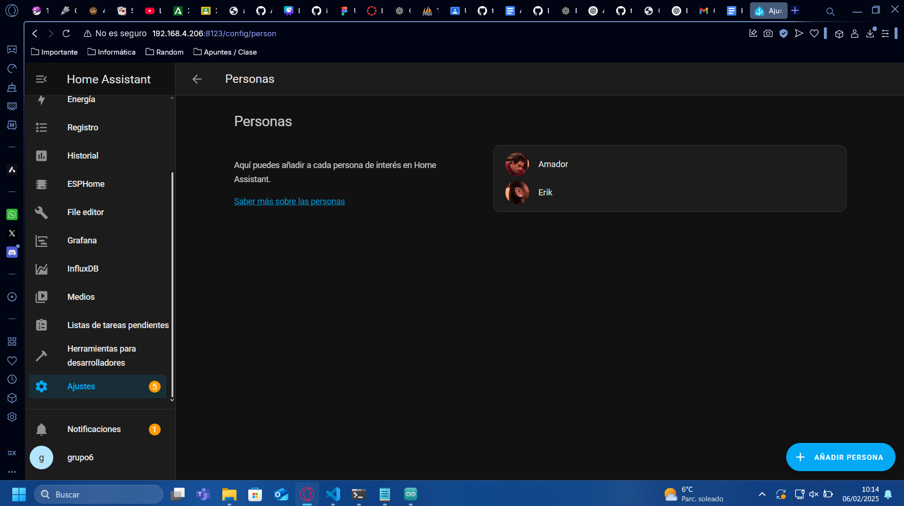
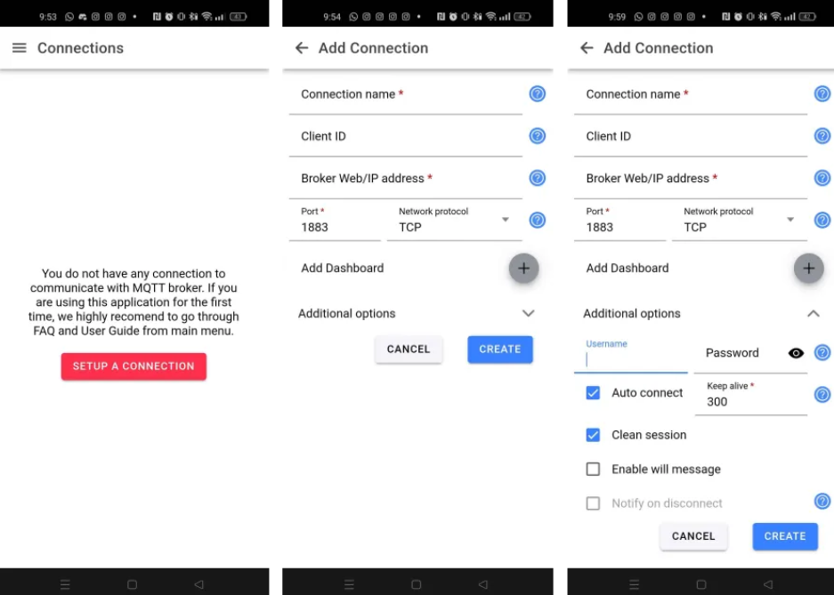
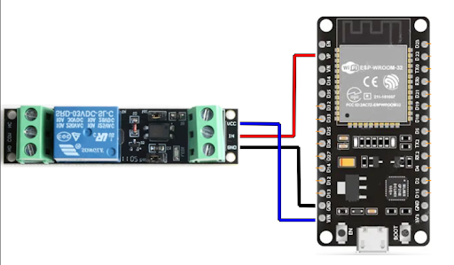
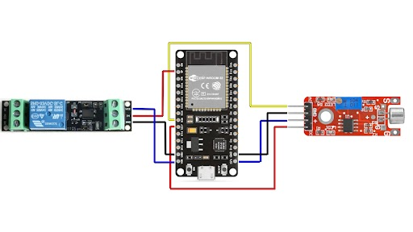
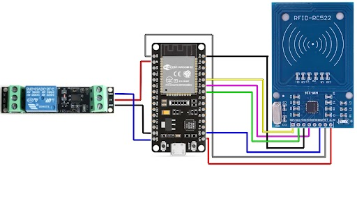

# Edificios inteligentes

## Tutorial: Conexión de Sensores a ESP32 con Arduino y MQTT

## 1. Introducción

En este tutorial aprenderemos a conectar diversos dispositivos para crear un entorno domótico en el que se maximizarán diversas áreas y optimizaremos procesos tales como la **seguridad**, **eficiencia**, **comodidad** y **sostenibilidad**. Uno de los hitos más destacados en este proyecto es la **automatización del control de acceso** con **RFID** conectado a una **cerradura electrónica**, permitiendo un control de acceso seguro y eficiente. Además, hemos implementado un **control de sonido automatizado durante la noche**, lo que no solo mejora la comodidad del entorno, sino que también contribuye a la seguridad al evitar ruidos molestos o intrusos durante las horas no laborables.

Estos avances son solo el principio de lo que podemos lograr con la integración de la tecnología en el ámbito educativo. La domótica es una herramienta clave para hacer que los espacios sean más inteligentes, adaptados a las necesidades y optimizados para una mejor gestión. ¡Acompáñanos a descubrir cómo hacerlo!

## 2. Materiales Necesarios

Lista de todo lo que necesitaremos:

- ESP32.
- Sensores (en este caso emplearemos un relé digital, un sensor KY-038 (sensor de sonido) y una cerradura electrónica).
- Protoboard y cables.
- Software: Arduino IDE, broker MQTT (p.ej., Mosquitto Broker).
- Ordenador con conexión a Internet.

---

## 3. Preparación del Entorno

### 3.1 Instalación del Arduino IDE

- Descargaremos el IDE de Arduino pulsando [aquí](https://www.arduino.cc/en/software).
- En el proceso de instalación pasaremos páginas hasta intalarlo.

### 3.1 Creación del proyecto ESP32

- Dentro de la interfaz debemos seleccionar la board de ESP32 Dev module.
- Puede que no esté habilitada en un inicio, por lo que antes deberemos elegir ESP32 Dev Board para posteriormente elegir la otra, que ya debería estar activa.
- Hecho esto la configuración inicial del proyecto estaría completada, quedando como la imagen posterior.



### 3.2 Ejecución de un proyecto

- Es esencial que a la hora de ejecutar nuestro proyecto tengamos conectada la ESP32 a nuestro ordenador, al menos por el momento. De esta forma, para ejecutar un proceso deberemos tener en cuenta lo siguiente:
  - Para poder ejecutar un proceso y que este pueda compilar correctamente, a la vez que pulsamos el botón correspondiente en nuestro programa (la flecha situada en la parte superior izquierda), también deberemos mantener pulsado un botón en nuestro ESP32 cercano al conector USB de nombre “boot”, hasta que el proceso haya sido exitoso.

### 3.3 Instalación de Librerías Necesarias

Librerías que deben instalarse desde el gestor de librerías:

- `PubSubClient` (para habilitar a conexión con MQTT).
- `MFRC522` (para habilitar la conexión del lector RFID RC522).

### Código de prueba en arduino

- Este código enciende y apaga un led del propio ESP32 periódicamente.

```cpp #define LED_BUILTIN 2

void setup() {
  // El código introducido aquí se ejecuta al inicio

  pinMode(LED_BUILTIN, OUTPUT);

}

void loop() {
  // El código introducido aquí se repite contínuamente

  digitalWrite(LED_BUILTIN, HIGH);
  delay(2000);
  digitalWrite(LED_BUILTIN, LOW);
  delay(2000);

}
```

---

## 4. Conexión de los Sensores

### 4.1 Uso de los Pines

Para realizar conexiones con nuestros pines de la placa ESP32 Wroom 32 nosotros hemos utilizado una placa de desarrollo que facilita el uso de los pines al permitirnos atornillar las conexiones sin necesidad de soldar. Para ello, tan solo es necesario desatornillar el pin que queremos utilizar, introducir en el hueco el cable que vamos a conectar y volver a apretar el tornillo, fijando la conexión.

### 4.2 Tabla de Pines para cada Dispositivo

| PIN          | Dispositivo | Conexión | Uso          |
| ------------ | ----------- | -------- | ------------ |
| GND          | Relé        | GND      | Tierra       |
| GPIO 26 (VP) | Relé        | IN       | Comunicación |
| 3.3V         | Relé        | VCC      | Alimentación |
| GPIO 21      | RFID-RC522  | SDA      | Comunicación |
| GPIO 18      | RFID-RC522  | SCK      | Comunicación |
| GPIO 23      | RFID-RC522  | MOSI     | Comunicación |
| GPIO 19      | RFID-RC522  | MISO     | Comunicación |
| GND          | RFID-RC522  | GND      | Tierra       |
| EN           | RFID-RC522  | RST      | Comunicación |
| 3.3V         | RFID-RC522  | 3.3V     | Alimentación |
| GND          | KY-038      | GND      | Tierra       |
| 3.3V         | KY-038      | +        | Alimentación |
| GPIO 27      | KY-038      | DO       | Comunicación |
| GPIO 26      | KY-038      | AO       | Comunicación |

---

## 5. Configuración del MQTT

MQTT (Message Queuing Telemetry Transport) es un protocolo de comunicación ligero y eficiente, diseñado para la transmisión de mensajes en redes con ancho de banda limitado o conexiones inestables. Se basa en el modelo publicador/suscriptor, donde los dispositivos (clientes) se comunican a través de un broker central.

En este caso usaremos Mosquitto Broker. Y nuestro principal objetivo será su posterior uso junto a Arduino IDE para ir modificando el estado de nuestro relé y que este trabaje según sea necesario.

Este será configurado desde dos perspectivas. Por la parte del servidor y por la del cliente.

### 5.1 Configuración del Broker MQTT para el servidor.

Este podrá ser configurado de varias maneras. Al haber trabajado con Home Assistant en otras ocasiones, nosotros decidimos hacerlo gracias a esto. Así, entraremos en nuestro HA y seguiremos los siguientes pasos:

- Instalamos en la pestaña Complementos de Ajustes la extensión de Mosquitto Broker:



- En la ruta Ajustes > Dispositivos y Servicios > MQTT, crearemos una Entrada de integración y la configuraremos presentando un Topic de escucha.



- Finalmente, en la ruta Ajustes > Personas, añadiremos una nueva. Quedando como en la imagen posterior.



### 5.2 Configuración del Broker MQTT para el cliente.

- Instalamos IoT MQTT Panel.
- Añadimos una nueva conexión.
- En las credenciales necesarias para conectarnos pondremos los siguientes datos:
  - Connection name: Cualquiera, el que mejor se adapte a nuestro proyecto.
  - Broker Web/IP address: La de nuestro servidor.
  - Add Dashboard: Hace falta añadir uno. Poner el nombre deseado.
  - En "Additional options" añadiremos nuestro username y password, los de la persona creada en Home Assistant.
  - Terminaremos el proceso haciendo click en CREATE.
- En este caso, usaremos MQTT para activar y desactivar el relé asociado, por lo que dentro de nuestra conexión añadiremos un Switch.
- Este switch tendrá de configuración:
  - Panel name: Lo que buscará, es decir, relé.
  - Payload on: ON
  - Payload off: OFF
  - Haremos click en CREATE.
- Hecho esto, cuando tengamos todo configurado y funcionando en nuestro Arduino IDE, al cambiar el estado del switch debería afectar directamente a nuestro relé.



---

## 6. Código Arduino

En esta sección, abordaremos el código necesario para la integración de los sensores y actuadores en la **ESP32**, utilizando **MQTT** para la comunicación con el sistema.

### Sensores y Actuadores Utilizados

A continuación, se detallan los sensores y actuadores empleados, junto con los pines de conexión en la **ESP32**:

| Componente            | Descripción                                                      |
| --------------------- | ---------------------------------------------------------------- |
| **Relé digital**      | Activa o desactiva el paso de corriente según una señal digital. |
| **Sensor KY-038**     | Detecta niveles de ruido de forma analógica o digital.           |
| **Cerradura digital** | Permite gestionar accesos abriendo o cerrando una cerradura.     |
| **RFID RC522**        | Autenticación con tarjetas o llaveros RFID.                      |

---

### 6.1 Código Base para la ESP32

Este código configura la conexión **WiFi** y el cliente **MQTT**

```cpp
#include <WiFi.h>
#include <PubSubClient.h>

//Configura aquí tu SSID y tu contraseña de la red
const char* ssid = secrets.SSID;
const char* password = secrets.password;

//Configura aquí tu servidor de mqtt, puerto contraseña y topic de comunicación que usaremos más adelante
const char* mqtt_server = "ha.ieshm.org";
const int mqtt_port = 1883;
const char* mqtt_user = "mqtt";
const char* mqtt_password = "mqtt";
const char* mqtt_topic = "g6/rele";

WiFiClient espClient;
PubSubClient client(espClient);

void setup_wifi() {
  Serial.println("Conectando a Wi-Fi...");
  WiFi.begin(ssid, password);
  while (WiFi.status() != WL_CONNECTED) {
    delay(1000);
    Serial.print(".");
  }
  Serial.println("\nWi-Fi conectado.");
  Serial.print("Dirección IP: ");
  Serial.println(WiFi.localIP());
}

void reconnect() {
  while (!client.connected()) {
    Serial.print("Intentando conectar al broker MQTT...");
    if (client.connect("ESP32", mqtt_user, mqtt_password)) {
      Serial.println("Conectado.");
      client.subscribe(mqtt_topic);
    } else {
      Serial.print("Fallo en la conexión, código de error: ");
      Serial.print(client.state());
      Serial.println(" Reintentando en 5 segundos...");
      delay(5000);
    }
  }
}

void setup() {

  //Es importante configurar el serial adecuado para que la salida aparezca en el IDE
  Serial.begin(115200);
  setup_wifi();
  client.setServer(mqtt_server, mqtt_port);
}

void loop() {
  if (!client.connected()) {
    reconnect();
  }
  client.loop();
}

```

### 6.2 Explicación de cada uno de los sensores

- Código que activa o desactiva el relé según mqtt



```cpp
#include <WiFi.h>
#include <PubSubClient.h>


const char* ssid = secrets.SSID;
const char* password = secrets.password;


const char* mqtt_server = "ha.ieshm.org";
const int mqtt_port = 1883;
const char* mqtt_user = "mqtt";
const char* mqtt_password = "mqtt";
const char* mqtt_topic = "g6/rele";


#define LED_BUILTIN 2
#define RELAY_PIN 26


WiFiClient espClient;
PubSubClient client(espClient);
String receivedMessage = "";


void setup_wifi() {
  delay(10);
  Serial.println("Conectando a Wi-Fi...");
  WiFi.begin(ssid, password);
  while (WiFi.status() != WL_CONNECTED) {
    delay(1000);
    Serial.print(".");
  }
  Serial.println("\nWi-Fi conectado.");
  Serial.print("Dirección IP: ");
  Serial.println(WiFi.localIP());
}


void callback(char* topic, byte* payload, unsigned int length) {
  String message = "";
  for (unsigned int i = 0; i < length; i++) {
    message += (char)payload[i];
  }
  receivedMessage = message;
  Serial.print("Mensaje recibido: ");
  Serial.println(receivedMessage);
}


void reconnect() {
  while (!client.connected()) {
    Serial.print("Intentando conectar al broker MQTT...");
    if (client.connect("ESP32", mqtt_user, mqtt_password)) {
      Serial.println("Conectado.");
      client.subscribe(mqtt_topic);
    } else {
      Serial.print("Fallo en la conexión, código de error: ");
      Serial.print(client.state());
      Serial.println(" Reintentando en 5 segundos...");
      delay(5000);
    }
  }
}


void setup() {
  Serial.begin(115200);


  pinMode(LED_BUILTIN, OUTPUT);
  pinMode(RELAY_PIN, OUTPUT);


  setup_wifi();
  client.setServer(mqtt_server, mqtt_port);
  client.setCallback(callback);


  digitalWrite(RELAY_PIN, LOW);
  Serial.println("Relé configurado y apagado.");
  digitalWrite(LED_BUILTIN, LOW);
  Serial.println("LED configurado y apagado.");
}


void loop() {
  if (!client.connected()) {
    reconnect();
  }
  client.loop();


  if (receivedMessage == "ON") {
    Serial.println("Encendiendo relé...");
    digitalWrite(RELAY_PIN, HIGH);
    Serial.println("Encendiendo LED...");
    digitalWrite(LED_BUILTIN, HIGH);
  } else if (receivedMessage == "OFF") {
    Serial.println("Apagando relé...");
    digitalWrite(RELAY_PIN, LOW);
    Serial.println("Apagando LED...");
    digitalWrite(LED_BUILTIN, LOW);
  }


}
```

- Código que enciende o apaga el relé según el nivel de ruido



```cpp
#include <WiFi.h>
#include <PubSubClient.h>


const char* ssid = secrets.SSID;
const char* password = secrets.password;


const char* mqtt_server = "ha.ieshm.org";
const int mqtt_port = 1883;
const char* mqtt_user = "mqtt";
const char* mqtt_password = "mqtt";
const char* mqtt_topic = "g6/rele";


#define LED_BUILTIN 2
#define RELAY_PIN 26


const int pinSound = 27;


WiFiClient espClient;
PubSubClient client(espClient);
String receivedMessage = "";


void setup_wifi() {
  delay(10);
  Serial.println("Conectando a Wi-Fi...");
  WiFi.begin(ssid, password);
  while (WiFi.status() != WL_CONNECTED) {
    delay(1000);
    Serial.print(".");
  }
  Serial.println("\nWi-Fi conectado.");
  Serial.print("Dirección IP: ");  Serial.println(WiFi.localIP());
}


void callback(char* topic, byte* payload, unsigned int length) {
  String message = "";
  for (unsigned int i = 0; i < length; i++) {
    message += (char)payload[i];
  }
  receivedMessage = message;
  Serial.print("Mensaje recibido: ");
  Serial.println(receivedMessage);
}


void reconnect() {
  while (!client.connected()) {
    Serial.print("Intentando conectar al broker MQTT...");
    if (client.connect("ESP32", mqtt_user, mqtt_password)) {
      Serial.println("Conectado.");
      client.subscribe(mqtt_topic);
    } else {
      Serial.print("Fallo en la conexión, código de error: ");
      Serial.print(client.state());
      Serial.println(" Reintentando en 5 segundos...");
      delay(5000);
    }
  }
}


void setup() {
  Serial.begin(115200);


  pinMode(LED_BUILTIN, OUTPUT);
  pinMode(RELAY_PIN, OUTPUT);
  pinMode(pinSound, INPUT);


  setup_wifi();
  client.setServer(mqtt_server, mqtt_port);
  client.setCallback(callback);


  digitalWrite(RELAY_PIN, LOW);
  Serial.println("Relé configurado y apagado.");
  digitalWrite(LED_BUILTIN, LOW);
  Serial.println("LED configurado y apagado.");
}


void loop() {
  if (!client.connected()) {
    reconnect();
  }
  client.loop();


  // Control del relé según mensaje MQTT
  if (receivedMessage == "ON") {
    Serial.println("Encendiendo relé...");
    digitalWrite(RELAY_PIN, HIGH);
    Serial.println("Encendiendo LED...");
    digitalWrite(LED_BUILTIN, HIGH);
  } else if (receivedMessage == "OFF") {
    Serial.println("Apagando relé...");
    digitalWrite(RELAY_PIN, LOW);
    Serial.println("Apagando LED...");
    digitalWrite(LED_BUILTIN, LOW);
  }


  // Control del relé según el sensor de sonido
  int soundState = digitalRead(pinSound);
  Serial.println("Estado del sonido ");
  Serial.println(soundState);
   // Leer el estado del sensor si detecta sonido
  if (soundState == HIGH) {
    Serial.println("Sonido detectado. Alternando estado del relé...");
    // Cambia el estado del relé
    digitalWrite(RELAY_PIN, !digitalRead(RELAY_PIN));
    delay(500);
  }
}

```

- Código que abre o cierra la cerradura electrónica

```cpp
#include <WiFi.h>
#include <PubSubClient.h>

// Es el mismo código del rele ya que activa y desactiva el mismo para abrir o cerrar la cerradura

const char* ssid = secrets.SSID;
const char* password = secrets.password;


const char* mqtt_server = "ha.ieshm.org";
const int mqtt_port = 1883;
const char* mqtt_user = "mqtt";
const char* mqtt_password = "mqtt";
const char* mqtt_topic = "g6/rele";


#define LED_BUILTIN 2
#define RELAY_PIN 26


WiFiClient espClient;
PubSubClient client(espClient);
String receivedMessage = "";


void setup_wifi() {
  delay(10);
  Serial.println("Conectando a Wi-Fi...");
  WiFi.begin(ssid, password);
  while (WiFi.status() != WL_CONNECTED) {
    delay(1000);
    Serial.print(".");
  }
  Serial.println("\nWi-Fi conectado.");
  Serial.print("Dirección IP: ");
  Serial.println(WiFi.localIP());
}


void callback(char* topic, byte* payload, unsigned int length) {
  String message = "";
  for (unsigned int i = 0; i < length; i++) {
    message += (char)payload[i];
  }
  receivedMessage = message;
  Serial.print("Mensaje recibido: ");
  Serial.println(receivedMessage);
}


void reconnect() {
  while (!client.connected()) {
    Serial.print("Intentando conectar al broker MQTT...");
    if (client.connect("ESP32", mqtt_user, mqtt_password)) {
      Serial.println("Conectado.");
      client.subscribe(mqtt_topic);
    } else {
      Serial.print("Fallo en la conexión, código de error: ");
      Serial.print(client.state());
      Serial.println(" Reintentando en 5 segundos...");
      delay(5000);
    }
  }
}


void setup() {
  Serial.begin(115200);


  pinMode(LED_BUILTIN, OUTPUT);
  pinMode(RELAY_PIN, OUTPUT);


  setup_wifi();
  client.setServer(mqtt_server, mqtt_port);
  client.setCallback(callback);


  digitalWrite(RELAY_PIN, LOW);
  Serial.println("Relé configurado y apagado.");
  digitalWrite(LED_BUILTIN, LOW);
  Serial.println("LED configurado y apagado.");
}


void loop() {
  if (!client.connected()) {
    reconnect();
  }
  client.loop();


  if (receivedMessage == "ON") {
    Serial.println("Encendiendo relé...");
    digitalWrite(RELAY_PIN, HIGH);
    Serial.println("Encendiendo LED...");
    digitalWrite(LED_BUILTIN, HIGH);
  } else if (receivedMessage == "OFF") {
    Serial.println("Apagando relé...");
    digitalWrite(RELAY_PIN, LOW);
    Serial.println("Apagando LED...");
    digitalWrite(LED_BUILTIN, LOW);
  }


}

```

- Código que recoge información sobre el acceso al aula con el dispositivo RFID



```cpp
#include <WiFi.h>
#include <PubSubClient.h>
#include <SPI.h>
#include <MFRC522.h>


const char* ssid = secrets.SSID;
const char* password = secrets.password;


const char* mqtt_server = "ha.ieshm.org";
const int mqtt_port = 1883;
const char* mqtt_user = "mqtt";
const char* mqtt_password = "mqtt";
const char* mqtt_topic = "g6/rele";


#define LED_BUILTIN 2
#define RELAY_PIN 26

// Pin RST del RC522
// Pin SDA del RC522

#define RST_PIN 22
#define SS_PIN 21


WiFiClient espClient;
PubSubClient client(espClient);
String receivedMessage = "";


MFRC522 rfid(SS_PIN, RST_PIN);


// Lista de tarjetas RFID autorizadas

const char* authorizedUIDs[] = {"A1B2C3D4", "E5F6G7H8"};
const int authorizedCount = sizeof(authorizedUIDs) / sizeof(authorizedUIDs[0]);


void setup_wifi() {
  delay(10);
  Serial.println("Conectando a Wi-Fi...");
  WiFi.begin(ssid, password);
  while (WiFi.status() != WL_CONNECTED) {
    delay(1000);
    Serial.print(".");
  }
  Serial.println("\nWi-Fi conectado.");
  Serial.print("Dirección IP: ");
  Serial.println(WiFi.localIP());
}


void callback(char* topic, byte* payload, unsigned int length) {
  String message = "";
  for (unsigned int i = 0; i < length; i++) {
    message += (char)payload[i];
  }
  receivedMessage = message;
  Serial.print("Mensaje recibido: ");
  Serial.println(receivedMessage);
}


void reconnect() {
  while (!client.connected()) {
    Serial.print("Intentando conectar al broker MQTT...");
    if (client.connect("ESP32", mqtt_user, mqtt_password)) {
      Serial.println("Conectado.");
      client.subscribe(mqtt_topic);
    } else {
      Serial.print("Fallo en la conexión, código de error: ");
      Serial.print(client.state());
      Serial.println(" Reintentando en 5 segundos...");
      delay(5000);
    }
  }
}


bool isAuthorizedUID(String uid) {
  for (int i = 0; i < authorizedCount; i++) {
    if (uid.equals(authorizedUIDs[i])) {
      return true;
    }
  }
  return false;
}


void setup() {
  Serial.begin(115200);


  pinMode(LED_BUILTIN, OUTPUT);
  pinMode(RELAY_PIN, OUTPUT);


  setup_wifi();
  client.setServer(mqtt_server, mqtt_port);
  client.setCallback(callback);


  digitalWrite(RELAY_PIN, LOW);
  Serial.println("Relé configurado y apagado.");
  digitalWrite(LED_BUILTIN, LOW);
  Serial.println("LED configurado y apagado.");


  SPI.begin();
  rfid.PCD_Init();
  Serial.println("Inicializando lector RFID...");
}


void loop() {
  if (!client.connected()) {
    reconnect();
  }
  client.loop();


  if (receivedMessage == "ON") {
    Serial.println("Encendiendo relé por MQTT...");
    digitalWrite(RELAY_PIN, HIGH);
    Serial.println("Encendiendo LED por MQTT...");
    digitalWrite(LED_BUILTIN, HIGH);
  } else if (receivedMessage == "OFF") {
    Serial.println("Apagando relé por MQTT...");
    digitalWrite(RELAY_PIN, LOW);
    Serial.println("Apagando LED por MQTT...");
    digitalWrite(LED_BUILTIN, LOW);
  }


  if (rfid.PICC_IsNewCardPresent() && rfid.PICC_ReadCardSerial()) {
    String uid = "";
    for (byte i = 0; i < rfid.uid.size; i++) {
      uid += String(rfid.uid.uidByte[i], HEX);
    }
    uid.toUpperCase();
    Serial.print("UID detectado: ");
    Serial.println(uid);


    if (isAuthorizedUID(uid)) {
      Serial.println("Tarjeta autorizada. Cambiando estado del relé...");
      int currentState = digitalRead(RELAY_PIN);
      digitalWrite(RELAY_PIN, !currentState);


      if (currentState == LOW) {
        Serial.println("Encendiendo LED...");
        digitalWrite(LED_BUILTIN, HIGH);
      } else {
        Serial.println("Apagando LED...");
        digitalWrite(LED_BUILTIN, LOW);
      }
    } else {
      Serial.println("Tarjeta no autorizada.");
    }


    rfid.PICC_HaltA();
  }
}

```

---

## 7. Implementación de la domótica a Home Assistant

En esta sección, adjuntaremos el código y los cambios realizados en nuestro servicio de Home Assistant abordando tanto el trabajo realizado para la activación de la cerradura mediante el lector de tarjetas RFID y la configuración realizada para el funcionamiento del sensor de sonido KY-038 y el envío de alertas en base a factores del mismo.

## 7.1. Cerradura con RFID.

A

## 7.2. Sensor KY-038 y alertas MQTT.

A

---

## 8. Aplicaciones domóticas

## 8.1 Aplicaciones Domóticas: Cerradura Digital, Eficiencia y Seguridad

En el mundo actual, la tecnología está transformando cada aspecto de nuestras vidas, y la educación no es la excepción. La automatización en el aula es un avance significativo que mejora la seguridad, la eficiencia y la comodidad de estudiantes y docentes.

### Cerradura Digital: La Seguridad del Futuro en el Aula

Las cerraduras digitales inteligentes permiten controlar el acceso al aula, asegurando que solo las personas autorizadas puedan entrar mediante una aplicación móvil o tarjetas RFID. Esto garantiza la seguridad de los recursos y personaliza el acceso según las necesidades.

### Eficiencia y Seguridad Combinados

Al eliminar llaves físicas, las cerraduras digitales evitan pérdidas y copias no autorizadas. Su integración con sistemas de vigilancia y alarmas mejora la seguridad y permite monitoreo en tiempo real, facilitando la gestión del aula.

### La Automatización: El Futuro del Aula Inteligente

La domótica permite que las aulas ajusten automáticamente luces, temperatura y acceso según la presencia de personas, el horario o el clima, optimizando la eficiencia energética y mejorando la experiencia educativa.

### Un Gran Avance en la Domótica del Aula

Las cerraduras digitales no solo refuerzan la seguridad, sino que también hacen que la gestión del aula sea más eficiente y organizada, integrándose en un sistema automatizado que facilita el control escolar.

### El Futuro es Ahora

La automatización educativa está en constante evolución, ofreciendo entornos más seguros y eficientes. Las cerraduras digitales y otros sistemas domóticos representan solo el inicio de un aula inteligente y conectada.

---
